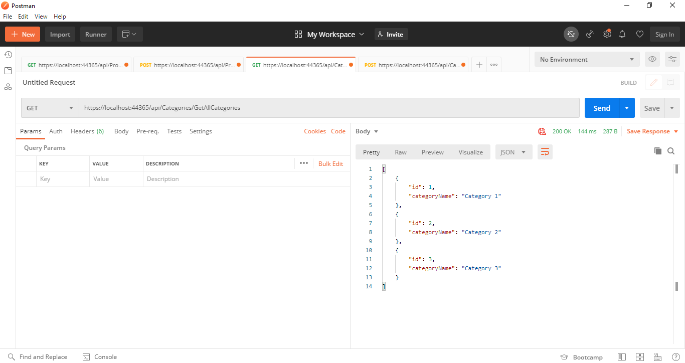
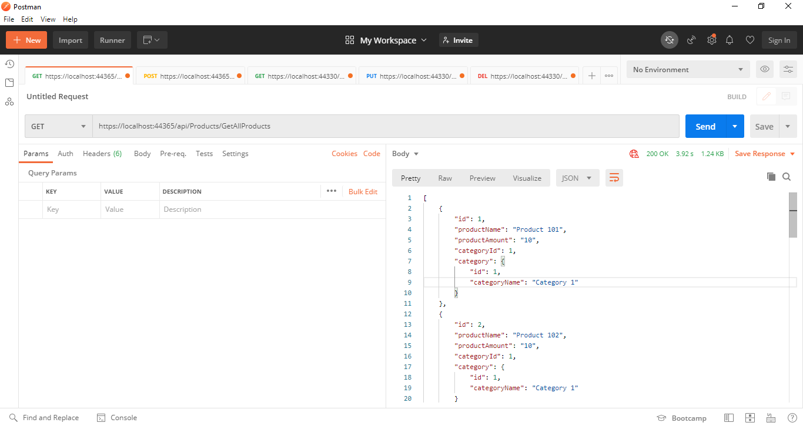
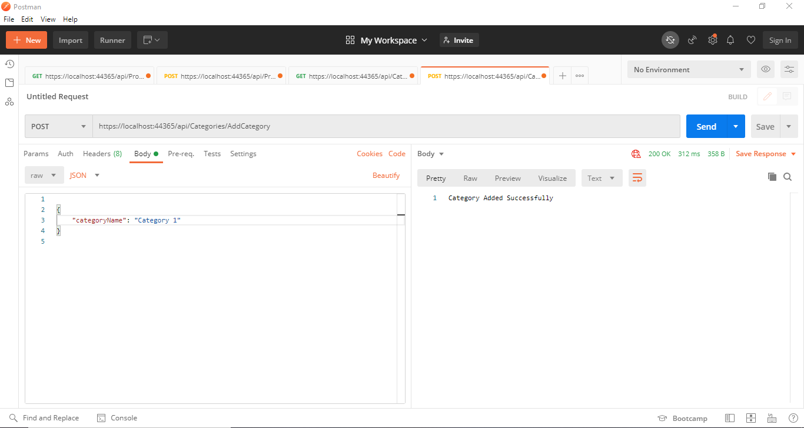
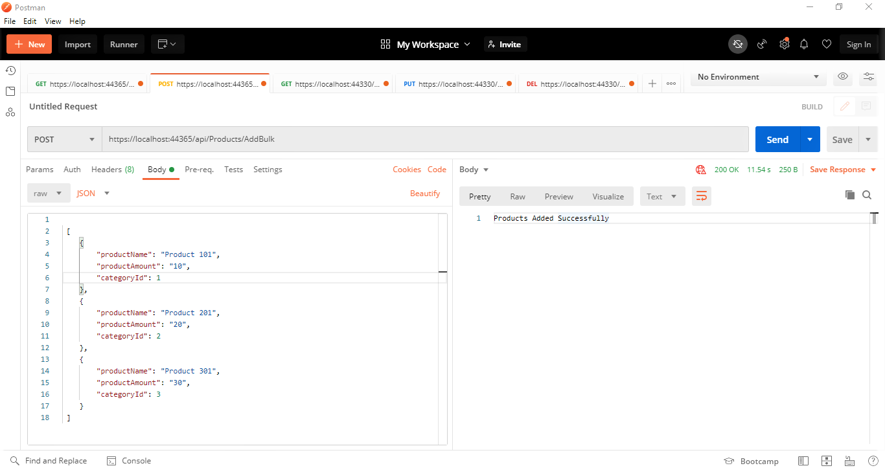

# ASP.NET Core Web Api

In This Project, I Used Code First Approch To Create Web API Using .NET 5 With Entity Framework Core (ORM) & Sql Sever (Database)


### Nuget Packages Used

``` 
Microsoft.EntityFrameworkCore
Microsoft.EntityFrameworkCore.SqlServer
Microsoft.EntityFrameworkCore.Tools
Microsoft.AspNetCore.Mvc.NewtonsoftJson
```

### Things Skipped Or Not Completed As Per Requirements :

- Not Added Unit Testing Only Did Manual Testing Using Postman
- Didn't Get Some Things, How To Do So Created Get & Save With Different Approch


## See the examples here: 

### Get All Categories :

``` https://localhost:44365/api/Categories/GetAllCategories ```



### Get All Products :

``` https://localhost:44365/api/Products/GetAllProducts ```



### Add Category :

``` https://localhost:44365/api/Categories/AddCategory ```

```javascript
  {
    "categoryName": "Category 1"
  }
```



### Add Bulk Products :

``` https://localhost:44365/api/Products/AddBulk ```

``` javascript

 [
    {
        "productName": "Product 101",
        "productAmount": "10",
        "categoryId": 1
    },
    {
        "productName": "Product 201",
        "productAmount": "20",
        "categoryId": 2
    },
    {
        "productName": "Product 301",
        "productAmount": "30",
        "categoryId": 3
    }
 ] 
```


